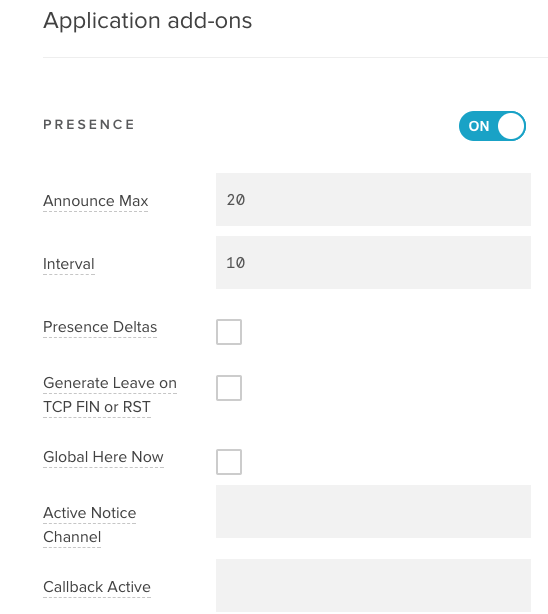
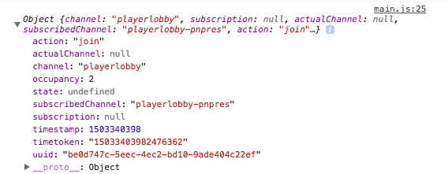
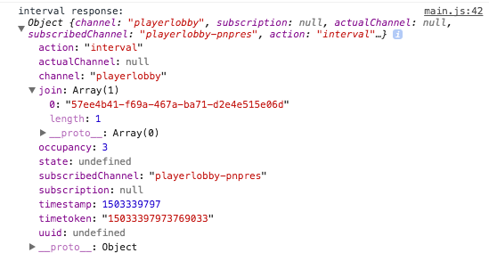

## What is PubNub Presence?

PubNub provides presence and state functionality which is built upon the publish & subscribe foundation making it easy to answer the question who’s online, and what are they doing? And being a global data stream network, PubNub will enable you to know when people come and go without repeated requests. The state provides data like name, age, online status (available, busy, typing, geo-location, etc.) enabling you to create rich user experience applications that leverage the actual participants of your application.

### Presence Use Cases

* Chat rooms: Showing users online status
* Collaborative Word doc: Showing who is typing
* Smart sensors: Showing how many devices are connected
* Multiplayer gaming: Showing all players names and stats
* Interactive media: audience-participating voting system

### Chat App Scenarios

* Notifying when a user has joined or left a channel
* Displaying who, and how many, users are subscribed to a particular channel
* Showing which channel(s) an individual user is subscribed to
* Showing associated state information for these users (location, typing status, etc)

## Setup Your PubNub Admin Dashboard

It's important that you setup the proper settings in your PubNub admin dashboard in order to make this application work as expected.

1. Navigate to the <a href="http://pubnub.com">PubNub home page</a> and sign up for a free account.
2. Once logged into the PubNub admin dashboard, click the ``Create New App +`` button
3. Name the application whatever you wish then click on the application you created in the dashboard.
4. Click on the demo keyset and **Turn ON** Presence.



Now that you have turned on Presence, lets discuss what each of these features do in the PubNub Admin Dashboard.

### Announce Max

When this number is hit, PubNub will **stop** sending subscribed clients **Join, Leave** or **Timeout** events.  You can set this number as low as **1** which means when **2** or more clients connect to a channel, you will only receive Interval Presence Events as often as the **Interval** is set in your PubNub Admin Dashboard. It is detrimental that you integrate Presence Interval events into your applications architecture because large groups of users in the same channel sending Presence events will use more messages.

When the number of clients is **less than or equal too** the Announce Max number, this is what a join event will look like:



When the number of clients is **greater than** the Announce Max number, this is what a join event will look like:



It's important to be aware that Presence messages will appear differently depending upon if the occupancy is below or above the announce max.  Note how the UUID on the **join** event is located in the ``uuid:`` section of the message.  However in the **interval** message, ``uuid:`` is ``undefined``.  You will need to archetype logic for each situation in order to prevent disruptions on the clients application.

### Interval

This number is the interval of how often clients will receive Interval Presence events once the Announce Max number has been exceeded.

### Presence Deltas

When you enable Presence Deltas, a list of each clients UUID that has joined and/or left the channel since the last Presence Interval message will be included in the next Presence Interval Message.


In the above screenshot, I have my **Announce Max** set to **2**, which means once **3** clients connect, PubNub will start sending Interval Events.  In this case, since UUID **57ee4b41...** joined the channel **playerlobby**, their UUID is shown in the Interval Event as ``join:``.

### Generate Leave on TCP FIN or RST

This feature is very important if you want subscribed clients to receive **leave** events when another client disconnects (this will only occur if the number of current occupants in a channel is under the Announce Max).  If you do not check this feature and a browser window is closed, subscribed clients will not receive the leave event from that disconnected client.  

However, if your application was using cookies on multiple browser windows, you might want to leave this feature unchecked. This is because if the user closes one window and leaves others open, it will send the **leave** event to all subscribed clients even though the client isn't disconnected and still has other windows open.

This is just one example on how you can use Generate Leave on TCP FIN or RST.  Shoot an email to support@pubnub.com if you have any further integration questions.

### Global Here Now 

When Global Here Now is checked, the ``pubnub.hereNow()`` function will return all current uuid's in every channel name that your client is subscribed too. Here is an example of what would be returned in the response of ``pubnub.hereNow()`` function:

```
{
    "status": 200,
    "message": "OK",
    "payload": {
        "channels": {
            "channel-1": {
                "uuids": [
                    "70fc1140-22b5-4abc-85b2-ff8c17b24d59"
                ],
                "occupancy": 1
            },
            "channel-2": {
                "uuids": [
                    "91363e7f-584b-49cc-822c-52c2c01e5928"
                ],
                "occupancy": 1
            },
            "channel-3": {
                "uuids": [
                    "ccfac1dd-b3a5-4afd-9fd9-db11aeb65395"
                ],
                "occupancy": 1
            }
        },
        "total_channels": 3,
        "total_occupancy": 3
    },
    "service": "Presence"
}
```

## PubNub Presence Sample Application

This demo is a stripped down javascript example that will teach you the basics of how to properly integrate presence into your application.

Make sure before you start that you have these features enabled in your PubNub Admin Dashboard:

1. Announce Max: **2**
2. Interval: **10**
3. Presence Deltas: **Checked**
4. Generate Leave on TCP FIN or RST: **Checked**
5. Global Here Now: **Checked**

### Create index.html

The first step is to create an HTML file called ``index.html`` and insert the following code:

You can download all of the project assets by <a href="https://github.com/JordanSchuetz/PubNub-Presence-Tutorial">
CLICKING HERE</a>

This HTML file imports the PubNub API into your project.  Copy and paste this code into your ``index.html`` document:

``` html
<!doctype html>
<head>
    <title>PubNub Presence Sample</title>
    <meta charset="utf-8">

    <script src="https://cdn.pubnub.com/sdk/javascript/pubnub.4.14.0.min.js"></script>
    <script src="https://ajax.googleapis.com/ajax/libs/jquery/3.1.0/jquery.min.js"></script>
    <script src="./main.js"></script>
</head>
<body>
<p id="p1">Open up the console (Cmd + Opt + J) to see this demo working live</p>
<p id="p2"></p>
</body>
</html>
```

### Create main.js

Next, lets create our PubNub Presence Application.  In our ``main.js`` file, copy and paste the following code.  We are going to walk you through it step by step after.

``` javascript
UniqueID = PubNub.generateUUID()
console.log("CLIENT BROWSER UUID: ", UniqueID)
document.write("Your Client's UUID is: ", UniqueID);
var playerList = [];

pubnub = new PubNub({
  publishKey: 'DEMO',
  subscribeKey: 'DEMO',
  uuid: UniqueID,
});

// Subscribe to the two PubNub Channels
pubnub.subscribe({
  channels: ['playerlobby'],
  withPresence: true,
});

listener = {
  status(response) {
  },
  message(response) {
  },
  presence(response) {
    //console.log(response)
    if (response.action === "join") {
      for(i=0; i < response.occupancy; i++){
        if(response.uuid !== undefined){
          var uuidMatchJoin = playerList.indexOf(response.uuid);
          console.log("UUID ARRAY INDEX: ", uuidMatchJoin, "UUID: ", response.uuid)
          if(uuidMatchJoin === -1){
            playerList[playerList.length] = response.uuid;
            console.log("Insert ", response.uuid, "in array" )
          } else {
            console.log("UUID: ", response.uuid, "is already in the array")
          }
        }
      }
    }

    if (response.action === "interval"){
      console.log("interval response: ", response)
      if(response.join !== undefined){
        for(i=0; i < response.occupancy; i++){
          if(response.join[i] !== undefined){
            var uuidMatchIntervalJoin = playerList.indexOf(response.join[i]);
            if(uuidMatchIntervalJoin === -1){
              console.log("Interval Add UUID: ", uuidMatchIntervalJoin);
              playerList[playerList.length] = response.join[i];
            }
          }
        }
      }

      if(response.leave !== undefined){
        for(i=0; i < response.occupancy; i++){
          var uuidMatchIntervalLeave = playerList.indexOf(response.leave[i]);
          if(uuidMatchIntervalLeave > -1){
            console.log("REMOVE PLAYER FROM ARRAY", uuidMatchIntervalLeave)
            playerList.splice(uuidMatchIntervalLeave, 1)
          }
        }
      }
    }

    if(response.action === "leave") {
      for(i=0; i < response.occupancy; i++){
        var uuidMatchLeave = playerList.indexOf(response.uuid);
        if(uuidMatchLeave > -1){
          console.log("REMOVE PLAYER FROM ARRAY", uuidMatchLeave, "with UUID: ", response.uuid)
          playerList.splice(uuidMatchLeave, 1)
        }
      }
    }
    console.log("Presence UUIDs:", playerList)
  },
}

function hereNow() {
  clearInterval(occupancyCounter)
  pubnub.hereNow(
  {
    channel: "playerlobby",
    includeUUIDs: true,
    includeState: true
  },
  function (status, response) {
    console.log("hereNow Response: ", response);
    for(i=0; i < response.totalOccupancy; i++){
      playerList[i] = response.channels.playerlobby.occupants[i].uuid;
    }
    console.log("hereNow UUIDs: ", playerList)
    pubnub.addListener(listener);
  });
}
occupancyCounter = setInterval(hereNow, 2000);

// If person leaves or refreshes the window, run the unsubscribe function
onbeforeunload = function() {
  globalUnsubscribe();

  $.ajax({
    // Query to server to unsub sync
    async:false,
    method: "GET",
    url: "https://pubsub.pubnub.com/v2/presence/sub-key/DEMO/channel/playerlobby/leave?uuid=" + encodeURIComponent(UniqueID) 
  }).done(function(jqXHR, textStatus) {
    console.log( "Request done: " + textStatus );
  }).fail(function( jqXHR, textStatus ) {
    console.log( "Request failed: " + textStatus );
  });
  return null;
}

// Unsubscribe people from PubNub network
globalUnsubscribe = function () {
  try {
    pubnub.unsubscribe({
      channels: ['playerlobby']
    });
    pubnub.removeListener(listener);
  } catch (err) {
    console.log("Failed to UnSub");
  }
};
```

Now where it says **DEMO**, replace those links with your Pub and Sub keys (you can get your keys from your PubNub Admin Dashboard).  Also don't forget in the ``$.ajax`` function to replace **DEMO** with your Sub key.

Now that you have copy and pasted the code into both documents, go ahead and save it and navigate to ``index.html`` and open it up with your web browser.  Then open up the developer console in your browser and observe how there are ``console.log`` statements being printed.  Open up different tabs/windows and observe how presence is interacting between the various clients.  If you open up a 3rd browser tab/window, you will notice that the clients won't receive a join event from the 3rd browser tab/window that we open.  This is because interval events have begun to occur since we set the **Announce Max** to **2** in the developer console.  You will have to wait 10 seconds before you get the updated join event from the PubNub servers.

### Code Walkthrough

First we generate a UUID and initialize PubNub.  We then subscribe to the playerlobby channel name.  That means any messages that get published to that channel, our client will receive them.

``` javascript
UniqueID = PubNub.generateUUID()
console.log("CLIENT BROWSER UUID: ", UniqueID)
document.write("Your Client's UUID is: ", UniqueID);
var playerList = [];

pubnub = new PubNub({
  publishKey: 'DEMO',
  subscribeKey: 'DEMO',
  uuid: UniqueID,
});

// Subscribe to the two PubNub Channels
pubnub.subscribe({
  channels: ['playerlobby'],
  withPresence: true,
});
```

Next we are going to create an unsubscribe function to unsubscribe a client from the channel name playerlobby.  In the ``globalUnsubscribe`` function we run an async unsubscribe that also removes the listener from listening to new messages published on the playerlobby channel.  The ``$.ajax`` unsubscribe is a synchronous request that uses PubNub's REST API to unsubscribe the user from the channel.

``` javascript
// If person leaves or refreshes the window, run the unsubscribe function
onbeforeunload = function() {
  globalUnsubscribe();

  $.ajax({
    // Query to server to unsub sync
    async:false,
    method: "GET",
    url: "https://pubsub.pubnub.com/v2/presence/sub-key/DEMO/channel/playerlobby/leave?uuid=" + encodeURIComponent(UniqueID) 
  }).done(function(jqXHR, textStatus) {
    console.log( "Request done: " + textStatus );
  }).fail(function( jqXHR, textStatus ) {
    console.log( "Request failed: " + textStatus );
  });
  return null;
}

// Unsubscribe people from PubNub network
globalUnsubscribe = function () {
  try {
    pubnub.unsubscribe({
      channels: ['playerlobby']
    });
    pubnub.removeListener(listener);
  } catch (err) {
    console.log("Failed to UnSub");
  }
};
```

When the web page loads, we run a 2000ms timer before the ``hereNow()`` function is called.  This timer is important since if your close and reopen the tab quickly, the occupancy may not update the correctly.  This is because ``hereNow()`` has a slight update delay.  The ``hereNow()`` response has a for loop that iterates through an array and adds occupants to the list.  It then starts the PubNub listener that listeners for status, message and presence events.
 
``` javascript
function hereNow() {
  clearInterval(occupancyCounter)
  pubnub.hereNow(
  {
    channel: "playerlobby",
    includeUUIDs: true,
    includeState: true
  },
  function (status, response) {
    console.log("hereNow Response: ", response);
    for(i=0; i < response.totalOccupancy; i++){
      playerList[i] = response.channels.playerlobby.occupants[i].uuid;
    }
    console.log("hereNow UUIDs: ", playerList)
    pubnub.addListener(listener);
  });
}
occupancyCounter = setInterval(hereNow, 2000);
```

This is the start of the PubNub listener code that listens for incoming messages from the PubNub channel you are subscribed too.

``response.action === "join"`` will only be triggered when a client joins a channel (under the Announce Max limit).

When a client joins the channel, the program iterates through the array to make sure no responses are undefined.  If the ``response.uuid`` matches with a UUID already in the array, do nothing.  But if the UUID is not in the array, go ahead and add it.

``` javascript
listener = {
  status(response) {
  },
  message(response) {
  },
  presence(response) {
    //console.log(response)
    if (response.action === "join") {
      for(i=0; i < response.occupancy; i++){
        if(response.uuid !== undefined){
          var uuidMatchJoin = playerList.indexOf(response.uuid);
          console.log("UUID ARRAY INDEX: ", uuidMatchJoin, "UUID: ", response.uuid)
          if(uuidMatchJoin === -1){
            playerList[playerList.length] = response.uuid;
            console.log("Insert ", response.uuid, "in array" )
          } else {
            console.log("UUID: ", response.uuid, "is already in the array")
          }
        }
      }
    }

```

The next portion of code handles the logic for interval events that are only activated once the announce max number has been reached.  If the ``response.join`` event is not undefined, iterate through the array and check to see if any of the interval events match with a UUID already in the array.  If the UUID doesn't exist (defined by the -1 index), add it to the array.  Then, if the ``response.leave`` event is not undefined, iterate through the array and check to see if any of the interval events match with a UUID already in the array.  If it does, remove that UUID from the array.

``` javascript
    if (response.action === "interval"){
      console.log("interval response: ", response)
      if(response.join !== undefined){
        for(i=0; i < response.occupancy; i++){
          if(response.join[i] !== undefined){
            var uuidMatchIntervalJoin = playerList.indexOf(response.join[i]);
            if(uuidMatchIntervalJoin === -1){
              console.log("Interval Add UUID: ", uuidMatchIntervalJoin);
              playerList[playerList.length] = response.join[i];
            }
          }
        }
      }

      if(response.leave !== undefined){
        for(i=0; i < response.occupancy; i++){
          var uuidMatchIntervalLeave = playerList.indexOf(response.leave[i]);
          if(uuidMatchIntervalLeave > -1){
            console.log("REMOVE PLAYER FROM ARRAY", uuidMatchIntervalLeave)
            playerList.splice(uuidMatchIntervalLeave, 1)
          }
        }
      }
    }

```

The last section of code listens for a ``response.action`` leave event.  If a leave event is sent (only will be sent if number of clients connected is under Announce Max), the program will iterate through the array and check to see if the UUID that left matches one that is already in the array.  If it is, remove the player from the array.

``` javascript

    if(response.action === "leave") {
      for(i=0; i < response.occupancy; i++){
        var uuidMatchLeave = playerList.indexOf(response.uuid);
        if(uuidMatchLeave > -1){
          console.log("REMOVE PLAYER FROM ARRAY", uuidMatchLeave, "with UUID: ", response.uuid)
          playerList.splice(uuidMatchLeave, 1)
        }
      }
    }
    console.log("Presence UUIDs:", playerList)
  },
}

```

## Wrapping Up

And that's it! We hope you benefited from this presence walk-through tutorial.  Hopefully, you can use this knowledge to architect your PubNub Presence powered application in the most efficient way possible.  

Questions? Tweet me @NinjaPigStudios or contact support@pubnub.com.  I'm here to help!
